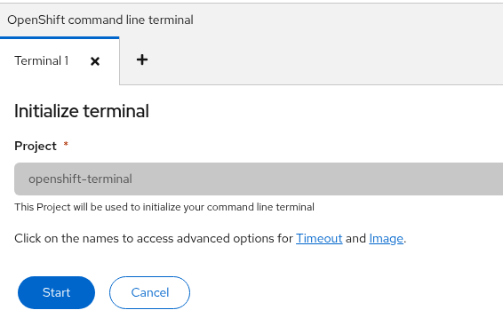
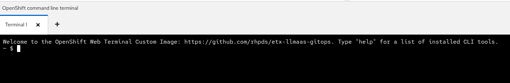
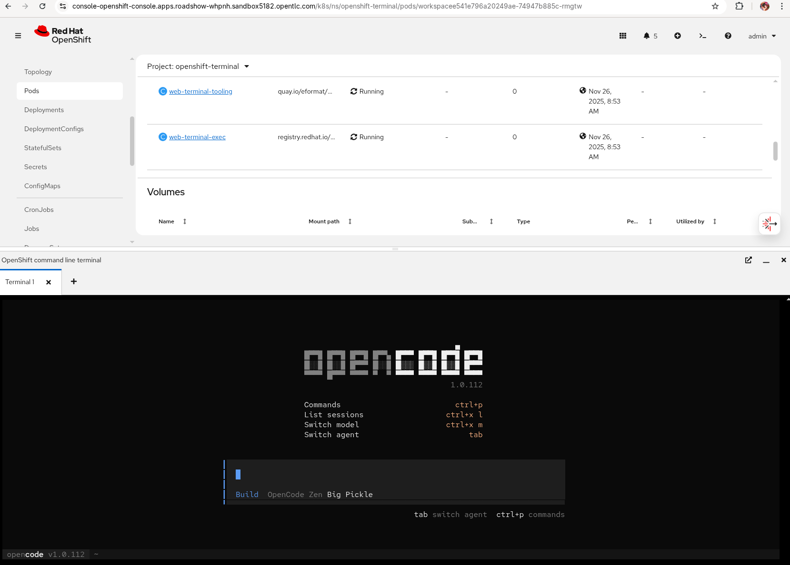
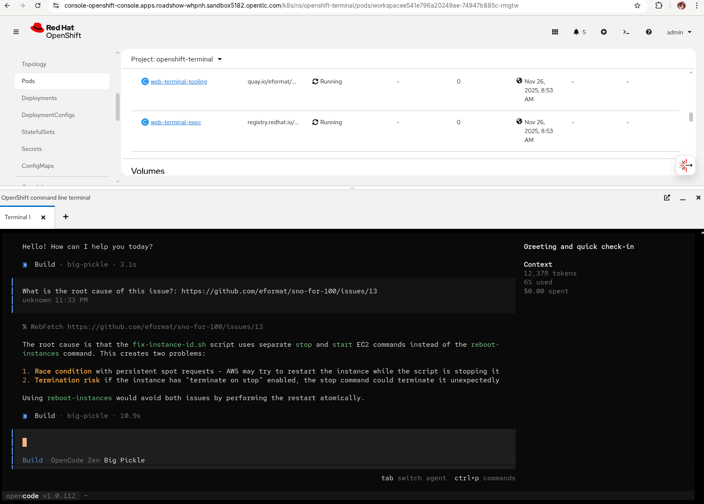

# Test Opencode CLI agent demo using web-terminal

1. Install web-terminal in your cluster. Login using oc as cluster-admin.

    ```bash
    curl -Ls https://raw.githubusercontent.com/eformat/rhoai-cluster-pool/refs/heads/main/bootstrap/web-terminal-all-in-one.sh | bash -s
    ```

2. Select `>_ OpenShift command line` in top right of OpenShift UI.

3. Initialze default terminal by hitting `Start`.

    

4. Wait for the custom image to download and start a pod in the `openshift-terminal` namespace. You should see the following prompt:

    

5. Install [`Opencode`](https://github.com/sst/opencode)

    ```bash
    npm i opencode-ai@latest
    ```

6. Put opencode on path.

    ```bash
    echo 'export PATH=$HOME/node_modules/.bin:$PATH' >> ~/.bashrc
    bash
    ```

7. Login to GitHub with a token.

    ```bash
    export GH_TOKEN=ghp_<redacted your token>
    gh auth login
    ```

8. Run `opencode` using the default model.

    ```bash
    opencode
    ```

    

9. Test a prompt.

    ```bash
    "What is the root cause of this issue? Give me a detailed anaylsis. Use gh client, then parse the issue details from the html: https://github.com/eformat/sno-for-100/issues/13"
    ```

    
